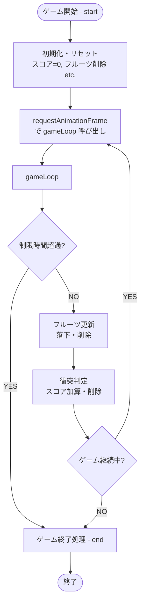

# ゲームループの仕組み — フルーツキャッチ（学習用サンプル）

このドキュメントでは、**フルーツキャッチ**というサンプルゲーム内で用いられている「ゲームループ (Game Loop)」の仕組みを、コードの流れとともに解説します。ゲームループは、ゲーム中に**繰り返し実行される処理**であり、キャラクターの移動や衝突判定などをリアルタイムに更新するための重要な役割を果たします。

---

## ゲームループの概要

1. **ゲーム開始**  
   - スタートボタンが押されると、ゲームエンジンが初期化されます。
   - 事前にリセットを行い、スコアを0に戻し、落下物のリストも空にします。

2. **`requestAnimationFrame()` による繰り返し呼び出し**  
   - ブラウザの描画タイミングに合わせて、`gameLoop()` 関数を**毎フレーム**呼び出します。
   - これにより、スムーズなアニメーションを実現します。

3. **ループの中で行う処理**  
   1. **時間制限のチェック**  
      - 30秒（例）の制限時間が過ぎていないかを確認します。  
      - もし制限時間を超過したら、ゲームを終了してループを止めます。  
   2. **落下物（フルーツ）の更新**  
      - 位置（top座標）を少しずつ下に移動させ、画面外に出たものを削除します。  
   3. **衝突判定**  
      - プレイヤーとフルーツが重なったら、スコアを加算しフルーツを消去。  
   4. **再帰的な呼び出し**  
      - 上記の処理が完了したら、まだゲームが続いている場合は再び `requestAnimationFrame()` を呼んで次フレームに進みます。

4. **ゲーム終了**  
   - 時間切れや他の条件を満たすと `end()` が呼ばれ、ゲームループが停止します。  
   - 終了時、最終スコアを表示し、フルーツ生成用のタイマーなども停止します。

---

## Mermaid 図解

以下の図は、「スタートボタンが押されてからゲームが終了するまでの流れ」を示しています。



1. **ゲーム開始 (A)**  
   - スタートボタンを押してゲームを始めると、`start()` メソッドで初期化を行います。  

2. **初期化・リセット (B)**  
   - スコアを0にし、プレイヤー位置を中央に移動。既存のフルーツを削除します。

3. **`requestAnimationFrame` の呼び出し (C)**  
   - 画面を滑らかに更新するため、ブラウザにアニメーションのフレーム処理を依頼します。

4. **ゲームループ (D → E → ...)**  
   1. **時間超過チェック (E)**: 指定した制限時間を超えたら終了へ。  
   2. **フルーツ更新 (H)**: 落下処理や画面外チェック。  
   3. **衝突判定 (I)**: プレイヤーとフルーツが重なったらスコア加算＆フルーツ削除。  
   4. **継続判定 (J)**: ゲームがまだ続くなら再び (C) に戻り、次フレームへ。

5. **ゲーム終了 (F → G)**  
   - ゲームループやフルーツ生成タイマーを停止し、最終スコアを表示して終わります。

---

## コード内での具体例

```js
// GameEngine クラス (抜粋)

// ゲームスタート時に呼ばれるメソッド
start() {
  this.reset();
  this.isGameRunning = true;
  this.startTime = Date.now();
  ...
  // 1秒ごとにフルーツ生成
  this.fruitSpawnInterval = setInterval(...);

  // ▼ ゲームループ開始
  this.gameLoopId = requestAnimationFrame(() => this.gameLoop());
}

// 実際のループ処理
gameLoop() {
  const elapsedTime = Date.now() - this.startTime;
  if (elapsedTime >= this.gameDuration) {
    this.end();
    return;
  }

  // フルーツの落下、衝突判定など
  this.fruits.forEach(...);

  // まだ続くなら次フレーム
  if (this.isGameRunning) {
    this.gameLoopId = requestAnimationFrame(() => this.gameLoop());
  }
}

// 終了処理
end() {
  clearInterval(this.fruitSpawnInterval);
  cancelAnimationFrame(this.gameLoopId);
  this.isGameRunning = false;
  alert(`ゲーム終了！ スコア: ${this.score}`);
}
```

- **`gameLoop()` の中で `requestAnimationFrame()` を再度呼んでいる**  
  - これにより、**フレームごと**に更新処理が繰り返され、キャラクターやフルーツが滑らかに動きます。  
- **制限時間 (this.gameDuration)**  
  - `elapsedTime >= this.gameDuration` を満たしたタイミングで `this.end()` に進み、ループを抜けます。

---

## まとめ

- **ゲームループ (Game Loop)** は、ゲームを動かすための「定期更新処理」です。  
- **`requestAnimationFrame()`** を使ってブラウザの描画タイミングに合わせて毎フレーム更新し、滑らかなアニメーションを実現します。  
- このループ内で**時間管理・オブジェクトの移動・衝突判定・スコア更新**などを行い、プレイヤーがリアルタイムで動くゲームを実現しています。  

